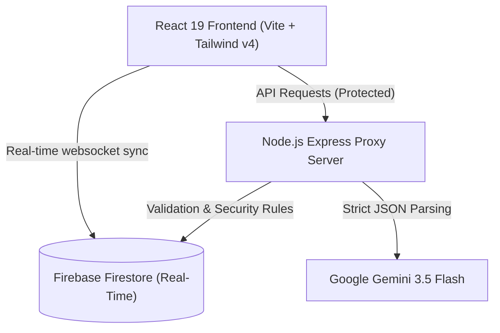

<div align="center">
  <h1>🍄 Mycelium</h1>
  <p><strong>Biological Neural Task Network & AI Productivity HUD</strong></p>
  
  <a href="https://mycelium-biological-neural-task-network-236120592145.asia-southeast1.run.app"><strong>Google AI Studio / Cloud Run Demo</strong></a> · 
  <a href="https://mycelium-ygel.onrender.com"><strong>Render Demo</strong></a>
</div>

<br />

## Problem
Traditional productivity apps treat tasks as cold, isolated checkmarks on flat lists. They rely on passive alerts (like push notifications) that offer zero resistance to procrastination. When users face complex tasks, they often experience "task paralysis" and ignore the alerts entirely.

## Solution
Mycelium is a living ecosystem that models your commitments as a subterranean fungal network. 
- Tasks are living **spores**. As time ticks, neglected nodes undergo **biological decay**, turning from vibrant indigo to decaying amber and warning rose. 
- Instead of passive alerts, Mycelium uses an active **Emergency Lockdown Protocol**, synthesizing Web Audio binaural beats to physically pull users into a flow state when a deadline is critically near.
- It features a 4-agent orchestrated system (The Spore, The Shroom, Myco-Field, Bio-Bridge) that actively parses unstructured text into tasks, diagnoses schedule risk, and intervenes with aggressive accountability.

## Architecture

Mycelium uses a secure, real-time decoupled architecture:



- **Biological Neural Grid**: A 2D physics-based engine using SVG connections where nodes visually pulse based on deadline risk.
- **Backend Proxy**: An Express.js layer that securely handles all AI logic, completely hiding the Gemini API Key from the client.
- **Real-Time State**: Firestore provides websocket synchronization across devices.
- **AI Core**: Powered by **Google Gemini 3.5 Flash** using strict JSON Structured Outputs to convert chaotic syllabus dumps into structured grid coordinates.

## Tech Stack
- **Frontend:** React 19, TypeScript, Vite, Tailwind CSS v4, Framer Motion
- **Backend:** Node.js, Express, `express-rate-limit`, `cors`
- **AI:** Google Gemini 3.5 Flash (`@google/genai` SDK)
- **Database:** Firebase Firestore (Real-time NoSQL)
- **Native APIs:** Web Audio API (Binaural Beats), Service Workers (PWA)

## Screenshots

<div align="center">

### 1. BIOLOGICAL NEURAL GRID
*Innovation & Creativity: Instead of a flat list, tasks are living spores connected by glowing hyphae that pulse based on deadline risk (Decaying, Unstable, Nutritional).*<br/>


<br/><br/>

### 2. INGEST CHAOTIC SYLLABUS OR MESSY EMAILS
*Google Tech Usage: Uses Google Gemini 3.5 Flash structured JSON outputs to autonomously parse messy text blocks directly into grid coordinates.*<br/>


<br/><br/>

### 3. COMMUTE NAVIGATION & CROWDSOURCED ECOSYSTEM LOGGING
*Technical Implementation: Demonstrates complex state management linking physical/ecological actions to digital vitality scores, securely backed by Firestore.*<br/>


<br/><br/>

### 4. ACTIVE SYMBIOTE AI INTERCOM
*Agentic Depth: The multi-agent ecosystem features four distinct personas (The Spore, The Shroom, Myco-Field, Bio-Bridge) that provide dynamic, autonomous accountability.*<br/>


<br/><br/>

### 5. ACTIVE TASK HUD CONTROLLER
*Product Experience & Design: A seamless, dark-mode, biological-terminal aesthetic built with Tailwind v4 that tracks "Accumulated Assimilation" and "Vitality Points".*<br/>


<br/><br/>

### EMERGENCY DECAY PROTOCOL
*Problem Solving & Impact: When a user procrastinates, Mycelium locks the screen and uses Web Audio binaural beats to force focus and cure task paralysis.*<br/>


<br/><br/>

### MYCELIUM CHIEF OF STAFF HUD (PWA View)
*Completeness & Usability: The app is a fully functional Progressive Web App (PWA) that syncs instantly across mobile and desktop environments.*<br/>


</div>

## Demo Link
- **[Google AI Studio / Cloud Run Demo](https://mycelium-biological-neural-task-network-236120592145.asia-southeast1.run.app)**
- **[Render Demo](https://mycelium-ygel.onrender.com)**

## Installation

### Prerequisites
- Node.js (v18 or higher)
- A Firebase Account
- A Google Gemini API Key

### Setup Instructions

1. **Clone the repository:**
   ```bash
   git clone https://github.com/TanayJalan/Mycelium.git
   cd Mycelium
   ```

2. **Install dependencies:**
   ```bash
   npm install
   ```

3. **Configure Environment Variables:**
   Create a `.env` file in the root directory:
   ```env
   GEMINI_API_KEY=your_gemini_api_key_here
   ```

4. **Boot the Development Server:**
   ```bash
   npm run dev
   ```

5. **Open the Web Application:**
   Go to [http://localhost:3000](http://localhost:3000) in your web browser.

## Results
- Successfully replaced flat-list task management with a physics-based spatial node grid.
- Achieved real-time task syncing and UI updates across multiple devices using Firebase.
- Implemented robust, reliable JSON extraction using Gemini 3.5 Flash for autonomous task scheduling.
- Fully operational Progressive Web App (PWA) with built-in acoustic focus states (Web Audio API).

## Future Improvements
- **Google Calendar Sync**: Bi-directional syncing to automatically map calendar events into the Mycelium grid.
- **Multiplayer Grids**: Allowing teams to share a subterranean network where one person's completion provides resources to another's tasks.
- **Wearable Integration**: Using Apple Watch or Fitbit heart-rate data to automatically adjust the intensity of the Emergency Lockdown binaural beats.

## Licence
This project is licensed under the MIT License. See the [LICENSE](LICENSE) file for details.
